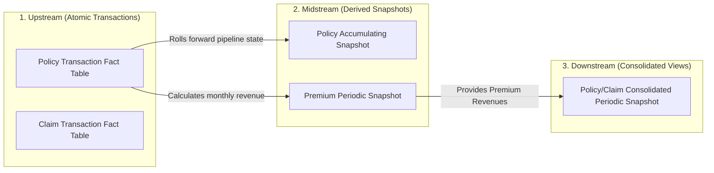

# 03 — Reading the Target Markdown

Every domain markdown file (e.g., `docs/insurance_target_markdown.md`) follows the same structure.
It is a **Kimball Dimensional Modeling** specification document. This skill teaches you how to read
it and extract everything you need to implement the analytics architecture.

---

## File Structure Overview

A target markdown file is divided into these top-level sections:

```
# <Domain> Tables

# Table-Use Case Overview        ← optional CSV table / mapping
# Table Lineage                  ← Mermaid flowchart
# Table Details                  ← per-table specifications
  ## <Process Group> Fact Tables
    ### <Table Name> Fact Table
  ## <Another Process Group>
    ### ...
# Timespan Accumulating Snapshot  ← optional advanced pattern note
```

---

## Section 1 — Table-Use Case Overview

An optional introductory table that maps each fact table to its primary analytical use cases and
its position in the data value chain (upstream → downstream).

**How to use it:** This gives you a high-level priority order. Upstream tables are atomic and
closest to source data; downstream tables are closest to "plug and play" analysis. Build upstream
tables first.

---

## Section 2 — Table Lineage (Mermaid Flowchart)

A Mermaid `flowchart LR` diagram showing data flow between fact tables. Example from insurance:



**How to use it:**
- Each node in the flowchart = **one star schema** you must implement.
- Upstream tables are independent; midstream tables derive from upstream; downstream from midstream.
- Build in this order: Upstream → Midstream → Downstream.
- The node label becomes the star schema's conceptual name (translate to `snake_case` for file paths).
- Arrow labels describe the derivation logic (e.g., "rolls forward pipeline state" means the
  accumulating snapshot is updated from the transaction fact).

**Star Schema Naming:** Convert the node label to `snake_case` for folder names:
- "Policy Transaction Fact Table" → `fact_policy_transactions`
- "Claim Accumulating Snapshot" → `claim_accumulated_snapshot`
- "Premium Periodic Snapshot" → `premium_periodic_snapshot`
- "Policy/Claim Consolidated Periodic Snapshot" → `consolidated`

---

## Section 3 — Table Details

This is the most important section. Each subsection describes one fact table in full detail.

### 3.1 Reading a Table Entry

Every table entry follows this pattern:

```markdown
### <Table Name>

<Brief description of what the table captures>

- **Grain:** Exactly one row per <entity description>
- **Key Facts:** <fact column names or descriptions>
- ER Diagram:
    ```mermaid
    erDiagram
        <Fact_Table> { ... }
        <Dim_Table> { ... }
        <Dim_Table> ||--o{ <Fact_Table> : ""
        ...
    ```
- **How it works:** <ETL behaviour: insert-only vs update, rolling forward, etc.>
- **Structure:** <Dimensional design notes: role-playing dates, degenerate dims, conformed dims>
- **Facts:** <Precise descriptions of each numeric measure>
- **Best Use Case:** <Primary analytical question this table answers>
```

### 3.2 Extracting the Grain

The **Grain** statement tells you exactly how to generate rows in `generate_facts.py`:

| Grain statement | Generator pattern |
|---|---|
| "one row per <transaction>" | Append-only, one row per event (atomic transaction) |
| "one row per <entity> (e.g., per claim)" | One row per entity; simulate open/closed states |
| "one row per <entity> per month" | Cartesian: for each entity × for each month-end date |
| "one row per <party> and their role per <event>" | Many-to-many bridge pattern |

### 3.3 Reading ER Diagrams

The Mermaid ER diagram defines both the **fact table schema** and all its **dimension tables**.

```mermaid
erDiagram
    Fact_Table {
        int date_id_FK           ← foreign key → becomes an int column in the fact
        int entity_id_FK         ← foreign key → must match IDs in the dimension
        string entity_number_DD  ← degenerate dimension → a string code, no join
        float amount_measure     ← additive measure → a float column
        int lag_days             ← lag fact → integer, calculated from date diff
    }
    Date_Dimension {
        int date_id_PK           ← primary key of this dimension
        date full_date
    }
    Date_Dimension ||--o{ Fact_Table : "label"  ← relationship: dim →* fact
```

**Column type mapping:**

| ER type | Python pandas dtype | Notes |
|---|---|---|
| `int ... _id_FK` | `int` (random.randint range) | Foreign key, match dim IDs |
| `int ... _id_PK` | Sequential int (`range(1, n+1)`) | Dimension primary key |
| `string ... _DD` | `str` (formatted code, e.g., `f"ORD-{i:05d}"`) | Degenerate dimension |
| `float ...` | `float` (round to 2dp) | Measure |
| `int lag_...` | `int` (`(date2 - date1).days`) | Duration in days |
| `date ...` | `str` `'YYYY-MM-DD'` | Store dates as strings in Parquet |
| `decimal ...` | `float` (round to 2dp) | Same as float |

**Role-playing date dimensions:** When you see multiple `date_id_FK` columns pointing to the same
`Date_Dimension` (e.g., `open_date_id_FK`, `close_date_id_FK`), generate each date as a
`datetime` value using `timedelta` to enforce chronological ordering. Use
`datetime(9999, 12, 31)` as the sentinel for "not yet reached" dates.

**Degenerate dimensions (`_DD`):** These are operational codes stored directly in the fact table
(no join to a dimension). Generate them as formatted strings: `f"<PREFIX>-{random.randint(...)}"`.

### 3.4 Understanding Fact Table Types and How to Generate Them

#### Atomic Transaction Fact Tables
- **Grain:** One row per discrete event (e.g., one row per transaction).
- **Generator pattern:** Loop `num_rows` times, each iteration = one event. Append-only.
- **Date pattern:** Single event date + optionally an "effective date" (slight future offset).
- **Measures:** Usually one generic measure (e.g., `transaction_dollar_amount`) whose meaning
  depends on a transaction type dimension.

#### Accumulating Snapshot Fact Tables
- **Grain:** One row per entity (e.g., one row per claim or policy), updated over its lifetime.
- **Generator pattern:** Loop `num_rows` times. Simulate lifecycle stages:
  - Pick a random start date.
  - Generate sequential milestone dates using `timedelta`.
  - Use `datetime(9999, 12, 31)` for milestones not yet reached.
  - Randomly assign "open" vs "closed" status to determine which milestones are populated.
- **Measures:** Cumulative to-date amounts, plus **lag columns** (duration between milestones).
- **Key insight:** This is NOT a slowly changing dimension — it is a fact table that gets
  destructively updated in production. For mock data, just generate a single snapshot state.

#### Periodic Snapshot Fact Tables
- **Grain:** One row per entity per time period (usually month-end).
- **Generator pattern:** Generate a set of entities (1..N). For each entity, generate rows for
  each month-end date in a date range (e.g., 24 months). Measures represent period activity
  (amounts paid/received during that month) or semi-additive balances (balance at month-end).
- **Date pattern:** Use a single `snapshot_date` column (month-end date).

#### Factless Fact Tables
- **Grain:** One row per participation of a party in an event.
- **Generator pattern:** Generate events (1..M). For each event, pick 2–5 random parties with
  different roles and generate one row each.
- **Measures:** Single dummy column, always set to `1` (e.g., `involvement_count = 1`).

#### Consolidated Fact Tables
- **Grain:** One row per entity per month at the "least common denominator" of dimensionality.
- **Generator pattern:** Can reuse rows from both the premium and claims periodic snapshots,
  joining on shared dimensions. Or generate from scratch matching that shared grain.
- **Measures:** Columns from both contributing tables side-by-side.

---

## Section 4 — Timespan Accumulating Snapshot (optional)

An advanced note at the end of some domain files. Describes adding `row_effective_date`,
`row_expiration_date`, and `current_row_flag` columns to an accumulating snapshot to track
historical states (similar to SCD Type 2 on a fact table).

**How to use it:** Only implement this if the domain markdown explicitly describes it for a
specific table. Add the three columns to that table's `generate_facts.py` output — set
`current_row_flag = True` for all rows in mock data since it's a single-state snapshot.

---

## Worked Example: Mapping Insurance Tables to Star Schemas

| Markdown table name | Star schema folder name | Table type |
|---|---|---|
| Policy Transaction Fact Table | `fact_policy_transactions` | Atomic transaction |
| Policy Accumulating Snapshot Fact Table | `claim_accumulated_snapshot`* | Accumulating snapshot |
| Premium Periodic Snapshot Fact Table | `premium_periodic_snapshot` | Periodic snapshot |
| Claim Transaction Fact Table | `claim_accumulated_snapshot`* | Atomic transaction |
| Claim Accumulating Snapshot Fact Table | `claim_accumulated_snapshot` | Accumulating snapshot |
| Claim Periodic Snapshot Fact Table | `claim_periodic_snapshot` | Periodic snapshot |
| Policy/Claim Consolidated Periodic Snapshot | `consolidated` | Consolidated |
| Factless Accident Events Fact Table | `factless_accident_events` | Factless |

*Note: Some stars share dimensions. When a fact table's grain and dimensions closely overlap with
another, they may share a folder. Use judgment based on the ER diagrams.

---

## Checklist: Before Writing Any Code

After reading the domain markdown, you should be able to answer:

- [ ] How many star schemas are there? (= number of distinct fact tables in lineage diagram)
- [ ] What is the `snake_case` folder name for each star schema?
- [ ] For each fact table: what is the exact grain?
- [ ] For each fact table: what are the measure columns and their types?
- [ ] For each fact table: what are the date FK columns (including role-playing dates)?
- [ ] For each fact table: what are the degenerate dimension columns?
- [ ] For each star schema: what dimension tables are needed? What columns does each have?
- [ ] Are any dimensions shared across star schemas (conformed dimensions like `dim_date`,
  `dim_customer`)?
- [ ] Is there an accumulating snapshot? If so, what are the milestone dates and lag columns?
- [ ] Is there a periodic snapshot? If so, what is the period (monthly/quarterly)?
- [ ] Is there a consolidated table? If so, which two processes does it combine, and at what grain?
- [ ] Is there a factless table? If so, what is the many-to-many relationship being captured?
