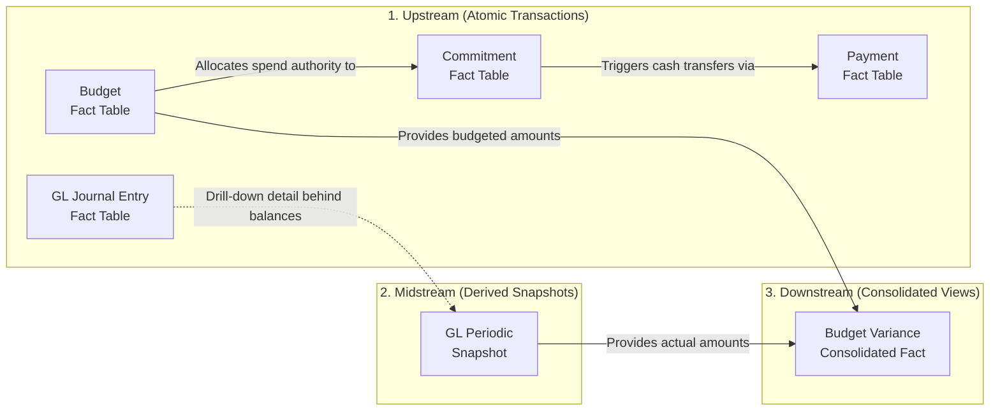

# Kimball accounting tables

# Table-Use case overview

This table contains the main fact tables of the data models outlined in Kimball's chapter on accounting.

[Uten navn](Uten%20navn%2036563a53758581ad8c32e87be010975f.csv)

# Table lineage



**Drill-down detail behind balances** (dashed edge): Kimball describes the GL Journal Entry and GL Periodic Snapshot tables as **complementary** schemas (p. 206), both sourced from the operational general ledger. The snapshot is built from period-end balances, not literally rolled forward from journal entries. The dashed arrow reflects the analytical relationship (drill from a balance to the postings that produced it), not an ETL data-flow.

**Budget → Commitment → Payment**: Kimball calls this a "chain" with a logical flow (p. 211). The dimensionality strictly grows as you move downstream — Budget has 4 dimensions, Commitment adds the Commitment dimension, Payment adds the Payment dimension on top.

# Table details

## General Ledger

### General Ledger Periodic Snapshot Fact Table

A periodic snapshot of every general ledger account at the close of each accounting period, used for trending, ranking, and period-over-period comparison of financial balances.

- **Grain:** Exactly **one row per accounting period × ledger × account × organization** at the most granular level in the chart of accounts.
- **Key Facts:** Period End Balance Amount *(semi-additive)*, Period Debit Amount, Period Credit Amount, Period Net Change Amount.
- ER diagram
    
    ```mermaid
    erDiagram
        GL_Snapshot_Fact {
            int accounting_period_id_FK
            int ledger_id_FK
            int account_id_FK
            int organization_id_FK
            int parent_snapshot_id_FK
            int fact_surrogate_key_PK
            float period_end_balance_amount
            float period_debit_amount
            float period_credit_amount
            float period_net_change_amount
        }
    
        Accounting_Period_Dimension {
            int accounting_period_id_PK
            int accounting_period_number
            string accounting_period_description
            int accounting_period_fiscal_year
        }
    
        Ledger_Dimension {
            int ledger_id_PK
            string ledger_book_name
        }
    
        Account_Dimension {
            int account_id_PK
            string account_name
            string account_category
            string account_type
        }
    
        Organization_Dimension {
            int organization_id_PK
            string cost_center_name
            string cost_center_number
            string department_name
            string division_name
            string business_unit_name
            string company_name
        }
    
        Accounting_Period_Dimension ||--o{ GL_Snapshot_Fact : ""
        Ledger_Dimension ||--o{ GL_Snapshot_Fact : ""
        Account_Dimension ||--o{ GL_Snapshot_Fact : ""
        Organization_Dimension ||--o{ GL_Snapshot_Fact : ""
    ```
    
- **How it works:** At the close of each fiscal period (typically monthly), the ETL inserts one row per account × organization × ledger. The Period End Balance Amount is **semi-additive** — it adds across non-time dimensions, but across time it must be averaged or last-row-selected rather than summed. The balance is stored on the fact table even though it isn't strictly "G/L activity" because computing it on the fly would require traversing every journal entry from the beginning of time.
- **Structure:** Account and Organization are the two crucial dimensions, derived from the enterprise's conformed chart of accounts and its cost-center → department → division → business-unit rollup respectively. The **Ledger** dimension allows multiple sets of books to live in the same fact table, but every query must constrain to a single ledger or balances double-count — Kimball recommends deploying single-ledger views over this fact table. For very large enterprises with multi-layer ledgers (enterprise → division → department), Kimball's variant in Fig. 7-4 adds an explicit fact-table surrogate key and a parent-snapshot-key foreign key on the fact row itself, enabling drill-down from a high-level entry to its constituent lower-level entries via a recursive self-join on the fact table. In multinational implementations, fact columns are duplicated to carry both local-currency and standardized corporate-currency amounts side-by-side on the same row.
- **Best Use Case:** Period-end account-balance trending, account rankings, and period-over-period comparisons. The snapshot also serves as the basis for aggregated **financial-statement schemas** (p. 209-210), where rows are pre-tagged with statement line numbers and labels so managers can easily monitor a specific income-statement or balance-sheet line over time.

### General Ledger Journal Entry Fact Table

A transaction-grain table that records every posting to the general ledger, used as the drill-down complement to the periodic snapshot.

- **Grain:** Exactly **one row per general ledger journal entry transaction**.
- **Key Facts:** Journal Entry Amount.
- ER diagram
    
    ```mermaid
    erDiagram
        GL_Journal_Entry_Fact {
            int post_date_id_FK
            int journal_entry_effective_date_id_FK
            int ledger_id_FK
            int account_id_FK
            int organization_id_FK
            int debit_credit_indicator_id_FK
            string journal_entry_number_DD
            float journal_entry_amount
        }
    
        Debit_Credit_Indicator_Dimension {
            int debit_credit_indicator_id_PK
            string debit_credit_indicator_description
        }
    
        Date_Dimension ||--o{ GL_Journal_Entry_Fact : "post_date"
        Date_Dimension ||--o{ GL_Journal_Entry_Fact : "journal_entry_effective_date"
        Ledger_Dimension ||--o{ GL_Journal_Entry_Fact : ""
        Account_Dimension ||--o{ GL_Journal_Entry_Fact : ""
        Organization_Dimension ||--o{ GL_Journal_Entry_Fact : ""
        Debit_Credit_Indicator_Dimension ||--o{ GL_Journal_Entry_Fact : ""
    ```
    
- **How it works:** Rows are appended as journal entries are posted to the G/L. Like other transaction-grain tables, rows are never destructively updated — they represent events at a precise instant. The date dimension is daily-grained (the snapshot uses a coarser accounting-period dimension).
- **Structure:** Reuses **conformed** Account, Organization, and Ledger dimensions from the GL Snapshot. Two **role-playing date** dimensions distinguish the posting date from the effective accounting date when they differ. A small Debit-Credit Indicator dimension carries the textual description of the posting direction. The **Journal Entry Number** is treated as a **degenerate dimension** (no associated table); if those numbers are sequential, they double as a tie-breaker when the daily date grain is too coarse to sort entries unambiguously. If the source carries narrative descriptions or transaction types, a separate journal-entry-profile junk dimension is the right place for those rather than dumping freeform text onto the fact table.
- **Best Use Case:** Drilling into anomalies that surface at the snapshot level — large monthly balances whose explanation lives in a small number of unusual postings, or finding outliers hidden by monthly aggregation. The chapter frames the two tables as complementary: the snapshot is what business users start with, the journal entry table is where they end up when they need to explain a number.

## Budget Chain

### Budget Fact Table

Records **net-change** events on budget line items — the initial approved amount, plus any mid-year adjustments — rather than monthly balances.

- **Grain:** Exactly **one row per net change of a budget line item × organization cost center × G/L account during a given effective month**, for a given budget version.
- **Key Facts:** Budget Amount *(fully additive across all dimensions including time)*.
- ER diagram
    
    ```mermaid
    erDiagram
        Budget_Fact {
            int budget_effective_date_id_FK
            int budget_line_item_id_FK
            int account_id_FK
            int organization_id_FK
            float budget_amount
        }
    
        Budget_Effective_Date_Dimension {
            int budget_effective_date_id_PK
            string budget_effective_date_month
            int budget_effective_date_year
        }
    
        Budget_Line_Item_Dimension {
            int budget_line_item_id_PK
            string budget_name
            string budget_version
            string budget_line_description
            int budget_year
            string budget_line_subcategory_description
            string budget_line_category_description
        }
    
        Budget_Effective_Date_Dimension ||--o{ Budget_Fact : ""
        Budget_Line_Item_Dimension ||--o{ Budget_Fact : ""
        Account_Dimension ||--o{ Budget_Fact : ""
        Organization_Dimension ||--o{ Budget_Fact : ""
    ```
    
- **How it works:** Kimball explicitly warns against modeling this as a periodic snapshot of "current status per budget line per month" — that grain produces semi-additive balances and forces duplicate rows when nothing changes. Instead, **only net-change events** are inserted. The first row for a budget year is created when the budget is initially approved. If a $200K annual budget is increased by $40K in June and trimmed by $25K in October, those are two additional rows. Summing all rows from beginning of time gives the current approved budget. Summing within a single month gives the changes that month.
- **Structure:** Effective Date is at month grain (or finer if the budget itself is broken down monthly). Budget Line Item carries the spending purpose, version, and category/subcategory hierarchy. **Account** and **Organization** are conformed dimensions reused directly from the GL design. One subtlety: when a single budget line affects multiple G/L accounts, the budget line must be allocated across accounts, producing several fact rows for one logical budget line — required to keep the grain honest.
- **Best Use Case:** Producing the current approved budget (sum all rows up to date); reporting in-year adjustments (filter to a single month). Provides the budgeted side of the actual-vs-budget variance analysis downstream.

### Commitment Fact Table

Records purchase orders, work orders, and contracts that commit budgeted dollars to specific parties — the second link in Kimball's budget → commitment → payment chain.

- **Grain:** Exactly **one row per commitment event** against a budget for an account in an organization.
- **Key Facts:** Commitment Amount.
- ER diagram
    
    ```mermaid
    erDiagram
        Commitment_Fact {
            int month_id_FK
            int organization_id_FK
            int account_id_FK
            int budget_id_FK
            int commitment_id_FK
            float commitment_amount
        }
    
        Commitment_Dimension {
            int commitment_id_PK
            string commitment_description
            string commitment_party
        }
    
        Month_Dimension ||--o{ Commitment_Fact : ""
        Organization_Dimension ||--o{ Commitment_Fact : ""
        Account_Dimension ||--o{ Commitment_Fact : ""
        Budget_Dimension ||--o{ Commitment_Fact : ""
        Commitment_Dimension ||--o{ Commitment_Fact : ""
    ```
    
- **How it works:** As the operational period unfolds, managers issue commitments (POs, work orders, contracts) against approved budget. Each commitment is appended as a fact row. Although money does not literally leave the company until payment, from a budget-management perspective committed dollars are no longer available to spend on something else.
- **Structure:** Inherits the four dimensions from Budget Fact — Month, Organization, Account, and Budget — and adds a **Commitment** dimension carrying the description and counterparty. This is the design pattern Kimball calls out for the chain: dimensionality strictly grows as you move from budget to commitment to payment, because each downstream step adds context the upstream step couldn't have known.
- **Best Use Case:** Comparing current commitments against the current budget by department (drill across with Budget Fact, sum each from beginning of time, compare). Cash-flow planning for finance, who need to know what's been committed but not yet paid.

### Payment Fact Table

Records actual cash outflows against commitments — the final link in the budget chain.

- **Grain:** Exactly **one row per payment event** against a commitment.
- **Key Facts:** Payment Amount.
- ER diagram
    
    ```mermaid
    erDiagram
        Payment_Fact {
            int month_id_FK
            int organization_id_FK
            int account_id_FK
            int budget_id_FK
            int commitment_id_FK
            int payment_id_FK
            float payment_amount
        }
    
        Payment_Dimension {
            int payment_id_PK
            string payment_description
            string payment_party
        }
    
        Month_Dimension ||--o{ Payment_Fact : ""
        Organization_Dimension ||--o{ Payment_Fact : ""
        Account_Dimension ||--o{ Payment_Fact : ""
        Budget_Dimension ||--o{ Payment_Fact : ""
        Commitment_Dimension ||--o{ Payment_Fact : ""
        Payment_Dimension ||--o{ Payment_Fact : ""
    ```
    
- **How it works:** Payments are recorded as monies are actually transferred. Finance is keenly interested in the relationship between commitments and payments because the lag is what they manage as cash position.
- **Structure:** Inherits all five dimensions from Commitment Fact and adds a **Payment** dimension (Payment Description, Payment Party — the latter is interesting because the payee may not always equal the commitment counterparty). Six dimensions total, the most of any table in the chain.
- **Best Use Case:** Tracking payments by payee; analyzing commitment-to-payment timing for cash management; auditing actual cash outflows against authorized commitments.

## Consolidated

### Budget Variance Fact Table (Actual vs. Budget)

A consolidated fact table that joins actuals from the GL Snapshot with budgeted amounts from the Budget Fact at the lowest level of granularity common to both processes.

- **Grain:** Exactly **one row per accounting period × account × organization**.
- **Key Facts:** Accounting Period Actual Amount, Accounting Period Budget Amount, Accounting Period Budget Variance *(calculated difference)*.
- ER diagram
    
    ```mermaid
    erDiagram
        Budget_Variance_Fact {
            int accounting_period_id_FK
            int account_id_FK
            int organization_id_FK
            float accounting_period_actual_amount
            float accounting_period_budget_amount
            float accounting_period_budget_variance
        }
    
        Accounting_Period_Dimension ||--o{ Budget_Variance_Fact : ""
        Account_Dimension ||--o{ Budget_Variance_Fact : ""
        Organization_Dimension ||--o{ Budget_Variance_Fact : ""
    ```
    
- **How it works:** Rather than forcing every BI tool to drill across the GL Snapshot and the Budget Fact and stitch the results together at query time, the ETL system does that join in the back room and stores a single fact table with both sides side-by-side plus the variance pre-calculated. Annual budgets are broken down to the accounting-period grain before being combined with actuals.
- **Structure:** Built on the **least-common-denominator** of dimensionality across the two source processes — only three dimensions survive (Accounting Period, Account, Organization). Dimensions that exist in one process but not the other (Ledger from GL, Budget Line Item from Budget Fact) are dropped or aggregated away. Kimball warns that this dimensionality compromise is the main risk of consolidated tables — teams sometimes design their whole warehouse at this grain and lose the ability to drill back to atomic detail. For multinational implementations, actuals are typically duplicated in local currency and standard currency, often with **both** effective and planned conversion rates so managers aren't penalized for currency fluctuations outside their control.
- **Best Use Case:** Executive variance reporting and actual-vs-budget dashboards — the most common cross-process question business managers ask, served fast and with no drill-across complexity. Should be built on top of finer-grained atomic schemas, not as a replacement for them.

---

# Ragged Variable-Depth Hierarchies via Bridge Tables

The organization rollup (cost center → department → division → business unit) is rarely as clean as it looks. Enterprises restructure, subsidiaries split and merge, and the levels themselves change. Recursive parent-pointers in the Organization dimension (a parent_org_key column on each row) work for a fixed structure but fail when the structure changes — and they make it impractical to support alternative rollup hierarchies, shared ownership, time-varying hierarchies, or type 2 SCD tracking on individual nodes.

Kimball's preferred solution is a separate **Organization Map bridge table** with one row per (parent, child) path in the tree, plus a Depth from Parent column and Highest-Parent / Lowest-Child flags. Each node connects to itself with depth 0. The bridge lives independently of the dimension table and can be joined into any of the budget-chain fact tables to enable drilling across **the entire chain at any rollup level** (Fig. 7-18). The bridge table is more ETL work to maintain and more work at query time, but it offers:

- Alternative rollup structures selected at query time
- Shared ownership rollups
- Time-varying hierarchies
- Limited blast radius for type 2 SCD changes on individual nodes
- Limited blast radius when the tree structure itself changes

The chapter also covers two alternatives, both with significant tradeoffs:

- **Pathstring attributes** (p. 221): encode the path from root to node as a delimited text string on each dimension row. Works with standard SQL string operators but is fragile under structural changes (a node renumbered near the root forces re-labeling of every descendant).
- **Modified Preordered Tree Traversal** (p. 222-223): assign each node a `[Left, Right]` numeric pair such that all descendants fall within those bounds. Compact for read queries but **even more fragile** — any tree change forces resequencing of the entire portion to the right.

Kimball recommends the bridge-table approach as the best balance of analytical flexibility versus ETL complexity.

# Year-to-Date Facts: Calculate, Don't Store

Designers are sometimes tempted to add quarter-to-date or year-to-date columns to fact rows so consumers don't have to compute them. Kimball is emphatic that they shouldn't.

To-date totals **aren't true to the grain**. When the fact table is queried and summarized in arbitrary ways, these untrue-to-the-grain columns produce overstated, nonsensical results — because they're already cumulative sums and any further aggregation across time double-counts. Compute to-date metrics in the BI tool or in OLAP cubes, where there's first-class support for time-aware aggregation. The relational fact table should stay clean.

# Multiple Fiscal Accounting Calendars

When subsidiaries operate on different fiscal calendars, the chapter offers three modeling options:

1. **Date dimension outrigger**: a multi-part key of (date, subsidiary) joined to a fiscal-attributes table holding the subsidiary-specific fiscal week and period end dates. A view that filters the outrigger by a single subsidiary makes it appear logically as part of the date dimension. Easy on ETL; relies on the BI tool to filter the outrigger consistently.
2. **Separate physical date dimensions per subsidiary**, sharing a common surrogate-key sequence. Useful when fact data is itself decentralized by subsidiary. The BI tool has to point at the correct date dimension for each subsidiary.
3. **Subsidiary fiscal-period foreign key on the fact table**, pointing to a (date × subsidiary)-cardinality fiscal-period dimension. Simpler for BI users (one key does it all) but heavier on ETL because the appropriate fiscal-period key has to be resolved on every fact row at load time.

The right option depends on whether you're optimizing for ETL simplicity (option 1) or BI-user simplicity (option 3).

[Kimball accounting-table use-case mapping](https://www.notion.so/8d7bebba54094567b438fa49dda0cb5c?pvs=21)