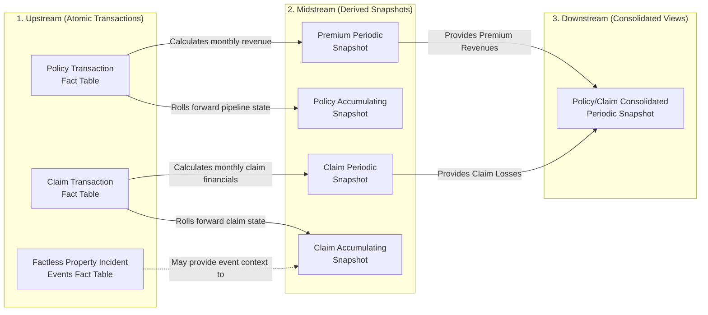

# Kimball insurance tables

# Table-Use case overview

This table contains the main fact tables of the data models outlined in Kimball’s chapter on insurance. The table describes example use cases that the data, and sorts the tables by data value chain position - i.e. is this a table that’s close to “plug and play analysis” or is it more “close to the source data”.

[Kimball insurance-table use-case mapping](Kimball%20insurance-table%20use-case%20mapping%2053f5e1ff1ff44e18b9bff71b274d72d5.csv)

# Table lineage



**Rolling forward**: This refers to the process of *incrementally updating* a snapshot table using the latest daily transactions, rather than recalculating the entire table from scratch.

Because operational transaction systems generate discrete events—such as opening a claim, setting a reserve, or making a payment—it would be a "nightmare" to try and re-create the current state of a claim every single day by reading its entire history of transactions from the very beginning. Instead, on a periodic basis (typically at the close of each day), the ETL process takes only the *new* transactions that occurred that day and uses them to "roll forward" the accumulating snapshot.

**May provide event context to**: This can be done by factless_incident_events >- dimensions -< fat_claim_accumulating_snapshot.

# Table details

## Policy-Related Fact Tables

### Policy Transaction Fact Table

An atomic, transaction-grain fact table that captures individual activities related to the formulation and modification of policies, such as creating, altering, rating, or canceling a policy or coverage.

- **Grain:** Exactly **one row for each individual policy transaction**.
- **Key Facts:** Policy Transaction Dollar Amount.
- ER-diagram
    
    ```mermaid
    erDiagram
        Policy_Transaction_Fact {
            int policy_transaction_date_id_FK
            int policy_effective_date_id_FK
            int policyholder_id_FK
            int employee_id_FK
            int coverage_id_FK
            int covered_item_id_FK
            int policy_transaction_type_id_FK
            int policy_transaction_audit_id_FK
            string policy_number_DD
            string policy_transaction_number_DD
            float policy_transaction_dollar_amount
        }
    
        Date_Dimension {
            int date_id_PK
            date full_date
        }
    
        Policyholder_Dimension {
            int policyholder_id_PK
            string name
        }
    
        Coverage_Dimension {
            int coverage_id_PK
            string coverage_name
        }
    
        Policy_Transaction_Type_Dimension {
            int policy_transaction_type_id_PK
            string type_description
        }
    
        Employee_Dimension {
            int employee_id_PK
            string employee_name
        }
    
        Covered_Item_Dimension {
            int covered_item_id_PK
            string item_description
        }
    
        Policy_Transaction_Audit_Dimension {
            int policy_transaction_audit_id_PK
            string audit_info
        }
    
        Date_Dimension ||--o{ Policy_Transaction_Fact : "transaction_date"
        Date_Dimension ||--o{ Policy_Transaction_Fact : "effective_date"
        Policyholder_Dimension ||--o{ Policy_Transaction_Fact : ""
        Coverage_Dimension ||--o{ Policy_Transaction_Fact : ""
        Policy_Transaction_Type_Dimension ||--o{ Policy_Transaction_Fact : ""
        Employee_Dimension ||--o{ Policy_Transaction_Fact : ""
        Covered_Item_Dimension ||--o{ Policy_Transaction_Fact : ""
        Policy_Transaction_Audit_Dimension ||--o{ Policy_Transaction_Fact : ""
    ```
    
- **How it works:** A new row is inserted into the fact table every time a discrete event is generated by the operational policy transaction system. This includes actions such as creating, altering, or canceling a policy; adding, altering, or canceling a coverage on a covered item; and rating or underwriting a policy.
- **Structure:** It is highly dimensional and relies on **role-playing date dimensions** to distinguish between the Policy Transaction Date (when it was entered into the system) and the Policy Effective Date (when it legally takes effect). It links to core dimensions like Policyholder, Employee (e.g., agent or underwriter), Coverage, Covered Item, and Policy Transaction Type. The Policy Number is typically included as a **degenerate dimension**. Because insurance products vary wildly, this table is often modeled as a "supertype" fact table containing common dimensions, which is then paired with "subtype" schemas for specific lines of business (like auto or home insurance) that require specialized attributes.
- **Facts:** The table typically features a single, generic numeric fact, such as the **Policy Transaction Dollar Amount**. Because the table combines many different kinds of transactions, you cannot label the fact more specifically; its actual business meaning must be interpreted by looking at the corresponding Policy Transaction Type dimension.
- **Best Use Case:** It is ideal for **analyzing policy formulation and alteration behavior in extreme detail**. Business users rely on it to answer granular questions about the volume and financial impact of specific events over time, such as tracking the reasons for policy cancellations or measuring how often underwriting declines to rate a coverage.

### Policy Accumulating Snapshot Fact Table

A snapshot table used to capture the cumulative effect of policy transactions, tracking the milestones and lifespan of a policy, its coverages, and covered items.

- **Grain:** Exactly **one row for each coverage and covered item on a policy**.
- **Key Facts:** While it contains an expanded set of facts compared to the transaction table, its primary additive metrics are time durations or lag times between key pipeline events (e.g., the lag between when a policy is quoted, rated, underwritten, effective, renewed, and expired).
- **ER diagram**
    
    ```mermaid
    erDiagram
        Policy_Accumulating_Snapshot_Fact {
            int quoted_date_id_FK
            int rated_date_id_FK
            int underwritten_date_id_FK
            int effective_date_id_FK
            int renewed_date_id_FK
            int expired_date_id_FK
            int policyholder_id_FK
            int agent_employee_id_FK
            int underwriter_employee_id_FK
            int coverage_id_FK
            int covered_item_id_FK
            int policy_audit_id_FK
            string policy_number_DD
            int quote_to_rate_lag_days
            int rate_to_underwrite_lag_days
            int underwrite_to_effective_lag_days
            int effective_to_renewed_lag_days
            int effective_to_expired_lag_days
            float premium_amount
        }
    
        Date_Dimension {
            int date_id_PK
            date full_date
        }
    
        Policyholder_Dimension {
            int policyholder_id_PK
            string name
        }
    
        Coverage_Dimension {
            int coverage_id_PK
            string coverage_name
        }
    
        Employee_Dimension {
            int employee_id_PK
            string employee_name
        }
    
        Covered_Item_Dimension {
            int covered_item_id_PK
            string item_description
        }
    
        Policy_Audit_Dimension {
            int policy_audit_id_PK
            string audit_info
        }
    
        Date_Dimension ||--o{ Policy_Accumulating_Snapshot_Fact : "quoted_date"
        Date_Dimension ||--o{ Policy_Accumulating_Snapshot_Fact : "rated_date"
        Date_Dimension ||--o{ Policy_Accumulating_Snapshot_Fact : "underwritten_date"
        Date_Dimension ||--o{ Policy_Accumulating_Snapshot_Fact : "effective_date"
        Date_Dimension ||--o{ Policy_Accumulating_Snapshot_Fact : "renewed_date"
        Date_Dimension ||--o{ Policy_Accumulating_Snapshot_Fact : "expired_date"
        Employee_Dimension ||--o{ Policy_Accumulating_Snapshot_Fact : "agent_employee"
        Employee_Dimension ||--o{ Policy_Accumulating_Snapshot_Fact : "underwriter_employee"
        Policyholder_Dimension ||--o{ Policy_Accumulating_Snapshot_Fact : ""
        Coverage_Dimension ||--o{ Policy_Accumulating_Snapshot_Fact : ""
        Covered_Item_Dimension ||--o{ Policy_Accumulating_Snapshot_Fact : ""
        Policy_Audit_Dimension ||--o{ Policy_Accumulating_Snapshot_Fact : ""
    ```
    
- **How it works:** A single row is created when the policy formulation pipeline begins and is continually updated to reflect its latest status as it progresses through standard milestones. It captures the cumulative lifespan of a policy, its covered items, and its coverages, rather than storing every individual transaction that occurred.
- **Structure:** It relies on **multiple date foreign keys** that represent predictable, policy-centric milestones, such as the dates it was quoted, rated, underwritten, effective, renewed, and expired. It reuses core dimensions like Policyholder, Coverage, and Covered Item, and often includes multiple role-playing Employee dimensions (e.g., the agent who sold it and the underwriter who approved it). Because it tracks the overall pipeline rather than distinct events, it explicitly omits transaction-type dimensions.
- **Facts:** It typically contains an expanded fact set capturing the overall, cumulative metrics associated with the policy. Like other accumulating snapshots, it is heavily reliant on **lag calculations** (durations) to track the elapsed time between the key milestone events.
- **Best Use Case:** It is ideal for analyzing the efficiency of the policy formulation pipeline. It allows business users to gain a clear picture of durations and lag times between key process events, such as tracking exactly how long it takes for a policy to move from being quoted to being fully underwritten and legally effective.

## Premium-Related Fact Tables

### Premium Periodic Snapshot Fact Table

Because it is difficult to determine the financial value of an in-force policy at a specific point in time from transactions alone, this monthly snapshot table captures metrics like written premium revenue and earned premium revenue. Kimball notes that for heterogeneous products (like auto vs. home insurance), this is often split into a single "supertype" snapshot and multiple "subtype" snapshots.

- **Grain:** Exactly **one row per coverage and covered item on a policy each month**.
- **Key Facts:** Written Premium Revenue Amount and Earned Premium Revenue Amount,.
- **ER diagram**
    
    ```mermaid
    erDiagram
        Premium_Snapshot_Fact {
            int Month_End_Snapshot_Date_Key_FK
            int Policyholder_Key_FK
            int Agent_Key_FK
            int Coverage_Key_FK
            int Covered_Item_Key_FK
            int Policy_Status_Key_FK
            int Policy_ID
            string Policy_Number_DD
            float Written_Premium_Revenue_Amount
            float Earned_Premium_Revenue_Amount
        }
    
        Policyholder_Dimension ||--o{ Premium_Snapshot_Fact : "refers to"
        Coverage_Dimension ||--o{ Premium_Snapshot_Fact : "refers to"
        Policy_Status_Dimension ||--o{ Premium_Snapshot_Fact : "refers to"
        Month_End_Dimension ||--o{ Premium_Snapshot_Fact : "refers to"
        Agent_Dimension ||--o{ Premium_Snapshot_Fact : "refers to"
        Covered_Item_Dimension ||--o{ Premium_Snapshot_Fact : "refers to"
    ```
    
- **How it works:** The insurance industry operates on a "pay-in-advance" model where a customer pays for a policy upfront, but the company actually earns that revenue incrementally over time as it provides the coverage. Because the rules for converting complex policy transactions into monthly revenue are incredibly complicated, it is highly impractical to calculate revenue on the fly by crawling through transaction records. Instead, a periodic snapshot takes a picture of the policy's financial value at the end of each month and stacks these consecutive snapshots in the data warehouse.
- **Structure:** It relies heavily on **conformed dimensions** shared with the policy transaction table, such as Policyholder, Covered Item, Coverage, and Agent. The daily date dimension is replaced by a **month-end date dimension**. Because this is a snapshot, transaction-type dimensions are omitted and replaced by a **Policy Status dimension** so users can quickly see the state of a policy (e.g., new, active, or canceled) in that specific month. Similar to transaction tables, if an insurer has widely different lines of business (like home vs. auto), this table is usually modeled as a global "supertype" snapshot table paired with line-of-business "subtype" snapshots. The Policy Number acts as a **degenerate dimension**.
- **Facts:** The table focuses on **pay-in-advance financial metrics**, specifically separating the **Written Premium Revenue Amount** from the **Earned Premium Revenue Amount**. For instance, if a customer buys a $600 annual policy on January 1, the January snapshot will record $600 in written premium but only $50 in earned premium. In the February snapshot, the written premium drops to $0, but the earned premium remains $50. If the policy is canceled in March, the written premium might show a negative $450 refund, while the earned premium for that final month is still $50.
- **Best Use Case:** It is essential for **analyzing top-line revenue and the financial status of in-force policies**. Because individual policy transactions don't equate to "little pieces of revenue" the way retail sales do, business users and field operations rely on this snapshot to answer questions about monthly earned income, sales volume, and longitudinal revenue trends over time

## Claim-Related Fact Tables

### Claim Transaction Fact Table

Captures the detailed stream of tasks that occur during the life of a claim, including opening a claim, setting reserves, adjuster inspections, lawsuits, and making or receiving payments.

- **Grain:** Exactly **one row for every claim task transaction** generated by the operational claim processing system.
- **Key Facts:** Claim Transaction Dollar Amount.
- ER Diagram
    
    ```mermaid
    erDiagram
        Claim_Transaction_Fact {
            int claim_transaction_date_id_FK
            int claim_loss_date_id_FK
            int policy_id_FK
            int claim_id_FK
            int claimant_id_FK
            int agent_id_FK
            int coverage_id_FK
            int covered_item_id_FK
            int claim_transaction_type_id_FK
            string claim_transaction_number_DD
            float claim_transaction_amount
        }
    
        Claim_Dimension {
            int claim_id_PK
            string claim_number
            string claim_description
            string fault_rating
            string claim_status
        }
    
        Policy_Dimension {
            int policy_id_PK
            string policy_number
            string policy_type
            date policy_effective_date
            date policy_expiration_date
        }
    
        Date_Dimension ||--o{ Claim_Transaction_Fact : "claim_transaction_date"
        Date_Dimension ||--o{ Claim_Transaction_Fact : "claim_loss_date"
        Policy_Dimension ||--o{ Claim_Transaction_Fact : ""
        Claim_Dimension ||--o{ Claim_Transaction_Fact : ""
        Claimant_Dimension ||--o{ Claim_Transaction_Fact : ""
        Agent_Dimension ||--o{ Claim_Transaction_Fact : ""
        Coverage_Dimension ||--o{ Claim_Transaction_Fact : ""
        Covered_Item_Dimension ||--o{ Claim_Transaction_Fact : ""
        Claim_Transaction_Type_Dimension ||--o{ Claim_Transaction_Fact : ""
    ```
    
- **How it works:** A new row is inserted into the fact table every time a discrete event occurs during the lifespan of a claim—such as opening a claim, setting a reserve, receiving a salvage payment, conducting an adjuster inspection, or making a payment. Because it records events at a precise instant in time, the data is simply appended and the rows are **typically never revisited or updated**.
- **Structure:** It relies on **role-playing date dimensions** (e.g., Claim Transaction Date and Claim Transaction Effective Date). It is highly dimensional, linking to tables like Policyholder, Employee (for the person handling the task), Coverage, Covered Item, Claimant, and 3rd Party Payee. It also typically features a **Claim Transaction Type dimension** to describe the exact action taken, a **Claim Profile junk dimension** to neatly group miscellaneous low-cardinality indicators, and **degenerate dimensions** for operational control numbers like the Claim Transaction Number and Policy Number.
- **Facts:** The table usually features a simple, fully additive numeric measure such as the **Claim Transaction Dollar Amount**. The actual business meaning of this single numeric column (e.g., whether it is a payment out, a reserve adjustment, or a salvage collection) is determined by evaluating it against the Transaction Type dimension.
- **Best Use Case:** It is ideal for **analyzing operational behavior in extreme detail**. Business users rely on transaction fact tables to answer highly specific questions that snapshots obscure, such as how often claims are reopened, measuring the frequency of specific task types, or tracking exact payment streams to outside experts like doctors, lawyers, and body shops.

### Claim Accumulating Snapshot Fact Table

Captures the overall workflow of a claim, storing the dates of key milestones (e.g., loss date, open date, first payment, close date) and calculating the lag times between them.

- **Grain:** One row per claim,.
- **Key Facts:** Original Reserve Dollar Amount, Estimate Dollar Amount, Current Reserve to Date Dollar Amount, Claim Paid to Date Dollar Amount, Salvage Collected to Date Dollar Amount, Subro Payment Collected to Date Dollar Amount, and the Number of Claim Transactions. It also includes lag facts like Claim Loss to Open Lag, Claim Open to Estimate Lag, and Claim Open to Closed Lag.
- ER Diagram
    
    ```mermaid
    erDiagram
        Claim_Fact {
            int claim_open_date_id_FK
            int claim_loss_date_id_FK
            int claim_estimate_date_id_FK
            int claim_1st_payment_date_id_FK
            int claim_most_recent_payment_date_id_FK
            int claim_subrogation_date_id_FK
            int claim_close_date_id_FK
            int policyholder_id_FK
            int claim_supervisor_id_FK
            int agent_id_FK
            int coverage_id_FK
            int covered_item_id_FK
            int claimant_id_FK
            int claim_status_id_FK
            int claim_profile_id_FK
            int claim_id_FK
            string policy_number_DD
            float original_reserve_dollar_amount
            float estimate_dollar_amount
            float current_reserve_to_date_dollar_amount
            float claim_paid_to_date_amount
            float salvage_collected_to_date_dollar_amount
            float subro_payment_collected_to_date_dollar_amount
            int claim_loss_to_open_lag
            int claim_open_to_estimate_lag
            int claim_open_to_1st_payment_lag
            int claim_open_to_subrogation_lag
            int claim_open_to_closed_lag
            int number_of_claim_transactions
        }
    
        Date_Dimension ||--o{ Claim_Fact : "open_date"
        Date_Dimension ||--o{ Claim_Fact : "loss_date"
        Date_Dimension ||--o{ Claim_Fact : "estimate_date"
        Date_Dimension ||--o{ Claim_Fact : "1st_payment_date"
        Date_Dimension ||--o{ Claim_Fact : "recent_payment_date"
        Date_Dimension ||--o{ Claim_Fact : "subrogation_date"
        Date_Dimension ||--o{ Claim_Fact : "close_date"
        Policyholder_Dimension ||--o{ Claim_Fact : ""
        Claim_Supervisor_Dimension ||--o{ Claim_Fact : ""
        Agent_Dimension ||--o{ Claim_Fact : ""
        Coverage_Dimension ||--o{ Claim_Fact : ""
        Covered_Item_Dimension ||--o{ Claim_Fact : ""
        Claimant_Dimension ||--o{ Claim_Fact : ""
        Claim_Status_Dimension ||--o{ Claim_Fact : ""
        Claim_Profile_Dimension ||--o{ Claim_Fact : ""
        Claim_Dimension ||--o{ Claim_Fact : ""
    ```
    
- **How it works:** A single row is created once when a claim is initially opened. As the claim progresses through the system, this exact row is revisited and destructively updated to reflect its most current state until the claim is finally closed.
    - It might be possible to add SCD2-like logic to track historical changes.
- **Structure:** It is characterized by **multiple date foreign keys** that represent standard, predictable milestones in the claims pipeline (e.g., Claim Loss Date, Claim Open Date, Claim 1st Payment Date, Claim Close Date).
- **Facts:** It stores cumulative, up-to-date numeric facts (e.g., Current Reserve to Date Dollar Amount, Claim Paid to Date Dollar Amount) alongside explicit **lag calculations** (e.g., Claim Loss to Open Lag, Claim Open to Closed Lag).
- **Best Use Case:** It is ideal for short-lived claims workflows where business users need to evaluate pipeline efficiency, understand product movement velocities, identify bottlenecks, and see the ultimate disposition of a claim.

### Claim Periodic Snapshot Fact Table

Suggested as an alternative to the accumulating snapshot for very long-lived claims (such as long-term disability or bodily injury) to track active claims at regular monthly intervals.

- **Grain:** One row for every active claim at a regular snapshot interval, such as monthly.
- **Key Facts:** Amount claimed, amount paid, and change in reserve during the period.
- ER Diagram
    
    ```mermaid
    erDiagram
        %% Dimension Tables
        DIM_DATE {
            int snapshot_date_key PK
            date full_date
            string month_name
            int year
        }
        DIM_POLICYHOLDER {
            int policyholder_key PK
            string name
            string address
        }
        DIM_CLAIM_SUPERVISOR {
            int claim_supervisor_key PK
            string supervisor_name
        }
        DIM_AGENT {
            int agent_key PK
            string agent_name
            string agency_location
        }
        DIM_COVERAGE {
            int coverage_key PK
            string coverage_type
            string limits
        }
        DIM_COVERED_ITEM {
            int covered_item_key PK
            string item_description
        }
        DIM_CLAIMANT {
            int claimant_key PK
            string claimant_name
        }
        DIM_CLAIM_STATUS {
            int claim_status_key PK
            string status_description
        }
        DIM_CLAIM_PROFILE {
            int claim_profile_key PK
            string profile_description
        }
        DIM_CLAIM {
            int claim_key PK
            string claim_description
            date open_date
        }
    
        %% Fact Table
        FACT_CLAIMS_PERIODIC_SNAPSHOT {
            int snapshot_date_key FK
            int policyholder_key FK
            int claim_supervisor_key FK
            int agent_key FK
            int coverage_key FK
            int covered_item_key FK
            int claimant_key FK
            int claim_status_key FK
            int claim_profile_key FK
            int claim_key FK
            varchar policy_number "DD (Degenerate Dimension)"
            varchar claim_number "DD (Degenerate Dimension)"
            decimal amount_claimed "Measure"
            decimal amount_paid "Measure"
            decimal change_in_reserve "Measure"
            decimal current_reserve_balance "Measure (Semi-additive)"
        }
    
        %% Relationships (One-to-Many from Dimensions to Fact)
        DIM_DATE ||--o{ FACT_CLAIMS_PERIODIC_SNAPSHOT : "Filters/Groups"
        DIM_POLICYHOLDER ||--o{ FACT_CLAIMS_PERIODIC_SNAPSHOT : "Filters/Groups"
        DIM_CLAIM_SUPERVISOR ||--o{ FACT_CLAIMS_PERIODIC_SNAPSHOT : "Filters/Groups"
        DIM_AGENT ||--o{ FACT_CLAIMS_PERIODIC_SNAPSHOT : "Filters/Groups"
        DIM_COVERAGE ||--o{ FACT_CLAIMS_PERIODIC_SNAPSHOT : "Filters/Groups"
        DIM_COVERED_ITEM ||--o{ FACT_CLAIMS_PERIODIC_SNAPSHOT : "Filters/Groups"
        DIM_CLAIMANT ||--o{ FACT_CLAIMS_PERIODIC_SNAPSHOT : "Filters/Groups"
        DIM_CLAIM_STATUS ||--o{ FACT_CLAIMS_PERIODIC_SNAPSHOT : "Filters/Groups"
        DIM_CLAIM_PROFILE ||--o{ FACT_CLAIMS_PERIODIC_SNAPSHOT : "Filters/Groups"
        DIM_CLAIM ||--o{ FACT_CLAIMS_PERIODIC_SNAPSHOT : "Filters/Groups"
    ```
    
    - We may also include Collected Amount (the amount is mentioned in the consolidated table).
- **How it works:** Instead of updating past rows, the system takes a "picture" of the claim's activity at the end of the period and stacks these new snapshot rows consecutively into the fact table. Past snapshots are preserved to retain the historical context.
- **Structure:** It generally uses a **single snapshot date column** representing the close of the period, rather than a wide array of milestone dates.
- **Facts:** It records additive facts representing the activity that occurred *during that specific time period* (e.g., the amount claimed, amount paid, and the change in reserve for that month), or semi-additive balances.
- **Best Use Case:** It is designed for long-lived claims (such as multi-year bodily injury or long-term disability claims) where it is necessary to analyze longitudinal performance trends over time. It is also the necessary format if you want to build a consolidated fact table that compares claim losses against premium revenues to analyze profitability.

## Consolidated and Factless Fact Tables

### Policy/Claim Consolidated Periodic Snapshot Fact Table

A consolidated table that brings together premium revenue metrics and claim loss metrics at a common, shared level of granularity, allowing business users to easily analyze profitability without having to query separate fact tables.

- **Grain:** Exactly **one row per month at the lowest level of granularity common to both processes**. This typically translates to one row per month for a given policyholder, covered item, coverage, and agent.
- **Key Facts:** Written Premium Revenue Dollar Amount, Earned Premium Revenue Dollar Amount, Claim Paid Dollar Amount, and Claim Collected Dollar Amount.
- ER Diagram
    
    ```mermaid
    erDiagram
        Policy_Claim_Consolidated_Snapshot_Fact {
            int month_end_snapshot_date_id_FK
            int policyholder_id_FK
            int coverage_id_FK
            int covered_item_id_FK
            int agent_id_FK
            int policy_status_id_FK
            int claim_status_id_FK
            string policy_number_DD
            float written_premium_revenue_dollar_amount
            float earned_premium_revenue_dollar_amount
            float claim_paid_dollar_amount
            float claim_collected_dollar_amount
        }
    
        Month_End_Snapshot_Date_Dimension ||--o{ Policy_Claim_Consolidated_Snapshot_Fact : ""
        Policyholder_Dimension ||--o{ Policy_Claim_Consolidated_Snapshot_Fact : ""
        Coverage_Dimension ||--o{ Policy_Claim_Consolidated_Snapshot_Fact : ""
        Covered_Item_Dimension ||--o{ Policy_Claim_Consolidated_Snapshot_Fact : ""
        Agent_Dimension ||--o{ Policy_Claim_Consolidated_Snapshot_Fact : ""
        Policy_Status_Dimension ||--o{ Policy_Claim_Consolidated_Snapshot_Fact : ""
        Claim_Status_Dimension ||--o{ Policy_Claim_Consolidated_Snapshot_Fact : ""
    ```
    
- **How it works:** Rather than forcing business users or BI tools to query separate policy and claims tables and stitch the results together (drilling across), the ETL system performs this integration in the back room. It combines the data from these separate business processes into a single, unified table, significantly **easing the analytic burden on the BI applications and users**.
- **Structure:** Because facts from multiple processes must be combined at the exact same level of granularity, this table is built on the **"least common denominator" of dimensionality**. It retains the shared, conformed dimensions—such as the Month End Date, Policyholder, Coverage, Covered Item, and Agent—along with status dimensions like Policy Status and Claim Status. Dimensions specific to only one of the original processes are eliminated or aggregated away.
- **Facts:** The table stores identically defined, conformed financial facts from both sides of the business side-by-side. It combines the pay-in-advance revenue metrics from the policy side (**Written Premium Revenue Dollar Amount** and **Earned Premium Revenue Dollar Amount**) with the loss metrics from the claims side (**Claim Paid Dollar Amount** and **Claim Collected Dollar Amount**).
- **Best Use Case:** It is ideal for **analyzing overall enterprise profitability**. By bringing together the components of revenue and loss into a single snapshot, business users can easily monitor bottom-line performance across customers, products (coverages), and distribution channels (agents) without writing complex queries.

### Factless Accident Events Fact Table

A factless fact table used to record the complex, many-to-many relationships and collisions between the various "loss parties" (people, witnesses, lawyers) and "loss items" (vehicles) involved in an accident event.

- **Grain:** Exactly **one row per involved party and their role during a specific property incident** (e.g., a mold discovery or pest inspection event) on a housing claim. If you use bridge tables to handle multiple parties, the grain could alternatively be preserved as exactly one row per incident/claim.
    - This is the grain (claim_number, loss_party_id, loss_party_role_id).
    - Example (i.e. note that values should have surrogate keys and not direct values)
        
        
        | claim_number | loss_party | loss_party_role | dummy_fact_count |
        | --- | --- | --- | --- |
        | cl-1 | john | tenant | 1 |
        | cl-1 | Pest Away ltd. | Pest Control Company | 1 |
        | cl-1 | jack | landlord | 1 |
        | cl-2 | mary | property owner | 1 |
        | cl-2 | Mold Busters Inc. | remediation contractor | 1 |
        | cl-2 | Dr. Spores | mycologist | 1 |
        | cl-3 | ABC Property Management | landlord | 1 |
        | cl-3 | sarah | tenant | 1 |
        | cl-3 | Termite Terminators | pest control specialist | 1 |
        | cl-3 | Smith & Co Law | legal representation | 1 |
- **Key Facts:** Because it is a factless fact table, it contains no variable measurement metrics,. Instead, it includes an artificial dummy fact (Accident Involvement Count = 1) to facilitate counting.
- ER Diagram
    
    ```mermaid
    erDiagram
        Claim_Accident_Event_Fact {
            int claim_loss_date_id_FK
            int policyholder_id_FK
            int coverage_id_FK
            int covered_item_id_FK
            int claimant_id_FK
            int loss_party_id_FK
            int loss_party_role_id_FK
            int claim_profile_id_FK
            string claim_number_DD
            string policy_number_DD
            int accident_involvement_count_IS_SET_TO_1
        }
    
        Claim_Loss_Date_Dimension ||--o{ Claim_Accident_Event_Fact : ""
        Policyholder_Dimension ||--o{ Claim_Accident_Event_Fact : ""
        Coverage_Dimension ||--o{ Claim_Accident_Event_Fact : ""
        Covered_Item_Dimension ||--o{ Claim_Accident_Event_Fact : ""
        Claimant_Dimension ||--o{ Claim_Accident_Event_Fact : ""
        Loss_Party_Dimension ||--o{ Claim_Accident_Event_Fact : ""
        Loss_Party_Role_Dimension ||--o{ Claim_Accident_Event_Fact : ""
        Claim_Profile_Dimension ||--o{ Claim_Accident_Event_Fact : ""
    ```
    
- **How it works:** For VIS, an event isn't a car crash; it's the "literal collision" of an event occurring in space and time—such as a termite inspection, the detection of black mold, or a water leak discovery. Because the event merely records entities coming together at the property without inherently generating a monetary payment (like a repair invoice would), it is modeled as a factless fact table.
- **Structure:** It brings together standard housing dimensions like Incident/Discovery Date, Policyholder, Coverage, and Covered Item (the specific house or property unit). Crucially, it introduces specific dimensions tailored to your niche: the **Involved Party** (to capture the specific exterminators, mold remediation companies, plumbers, or independent assessors) and the **Party Role** (to identify their capacity, such as initial inspector, primary remediator, or legal representative). It also includes your operational control numbers, like the Claim Number and Policy Number, as degenerate dimensions.
- **Facts:** Because it is a factless fact table, it does not store claim payment amounts or repair costs. Instead, it contains a single "dummy" fact—such as an **Incident Involvement Count**—that is permanently valued at 1 to facilitate easy counting and aggregation in SQL.
- **Best Use Case:** It is ideal for tracking the complex web of third-party experts involved in specialized property claims. It allows your business users to answer highly specific association questions, such as, "Exactly how many toxic mold claims this year involved 'ABC Mold Assessors' acting as the initial inspector alongside 'XYZ Remediation' doing the cleanup?"

---

# **Timespan Accumulating Snapshot**.

To implement this, you stop destructively updating the existing fact row when changes occur. Instead, you insert a new row that preserves the state of the fact for a specific span of time by adding three administrative columns directly to the fact table:

- A row effective date (Snapshot start date)
- A row expiration date (Snapshot end date)
- A current row indicator (Snapshot current flag).

**Application in Chapter 16 (Insurance)** In Chapter 16, Kimball explicitly applies this technique to the **Claim Accumulating Snapshot Fact Table**.

A standard claim accumulating snapshot does a great job of showing the current state of a claim workflow, but it obliterates the intermediate states. Because an insurance claim can move in and out of various volatile states over time (e.g., opened, denied, closed, disputed, opened again, and closed again), turning the table into a **Timespan Accumulating Snapshot** allows analysts to re-create the exact state of the claim workflow as of any arbitrary date in the past by filtering on the snapshot's start and end dates